# Baseball Swing Biomechanics Analysis

## Overview

This project analyzes biomechanical differences between baseball swings using motion capture and force plate data from the Driveline OpenBiomechanics dataset, mainly focusing on the pelvis and torso.

This takes two swings from different players, one from a lefty and one from a righty. These players are both the same height, weight, age, and playing level.

All swings were off of the same machine set at ~65 mph from ~40 ft away from home plate, and both of these swings had the same launch angle and were to the pull side.

The lefty had a max bat speed of 68.25 and a bat speed of 67.29 at contact, while the righty had a max bat speed of 76.32 and a bat speed of 74.51 at contact.

The goal is to understand some of the reasons why the righty is able to produce such a significant amount of bat speed compared to the lefty.

The analysis combines force plate data, joint kinematics, angular velocities, and hip-shoulder separation to evaluate swing efficiency and sequencing.

---

## Event Definitions

Key swing events were defined using dataset-provided times:

- **FP10** — lead-leg vertical force reaches **10% bodyweight**
- **FP100** — lead-leg vertical force reaches **100% bodyweight**
- **Contact** — provided bat-ball contact time

These were converted into frame indices for alignment across all signals.

---

## Analysis Windows

The swing was segmented into:

- **FP10-20 → FP10** *(20 frames before fp10 to fp10)*
- **FP10 → FP100** 
- **FP100 → FP100+20** *(fp 100 to 20 frames after fp100)*
- **FP100+20 → Contact**

- Lefty Frames: 487-507, 507-523, 523-543, 543-571
- Righty Frames: 707-727, 727-744, 744-764, 764-797

---

## Methods

### Force Plate Analysis

- Peak vertical force (Fz)
- Time to peak force
- Impulse across windows
- Force curve shape

### Rotational Kinematics

- Pelvis angular velocity
- Torso angular velocity
- Elbow and hand velocity
- Sequencing timing

### Hip-Shoulder Separation

- Separation at key events
- Maximum separation
- Separation velocity

---

## Lefty vs Righty Comparison

<table>
<tr>
<td align="center"><b>Lefty</b></td>
<td align="center"><b>Righty</b></td>
</tr>
<tr>
<td>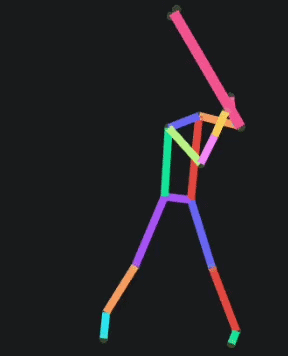</td>
<td></td>
</tr>
</table>

*Both swings are visualized from a consistent side-view perspective for direct comparison of sequencing and rotation.*

<table>
  <tr>
    <td align="center"><b>Lefty (FP100 – Side View)</b></td>
    <td align="center"><b>Righty (FP100 – Side View)</b></td>
  </tr>
  <tr>
    <td></td>
    <td></td>
  </tr>
</table>

<table>
  <tr>
    <td align="center"><b>Lefty (FP100 – Back View)</b></td>
    <td align="center"><b>Righty (FP100 – Back View)</b></td>
  </tr>
  <tr>
    <td></td>
    <td></td>
  </tr>
</table>

<table>
  <tr>
    <td align="center"><b>Lefty</b></td>
    <td align="center"><b>Righty</b></td>
  </tr>
  <tr>
    <td></td>
    <td></td>
  </tr>
</table>

<table>
  <tr>
    <td align="center"><b>Lefty</b></td>
    <td align="center"><b>Righty</b></td>
  </tr>
  <tr>
    <td></td>
    <td></td>
  </tr>
</table>

<table>
  <tr>
    <td align="center"><b>Lefty</b></td>
    <td align="center"><b>Righty</b></td>
  </tr>
  <tr>
    <td>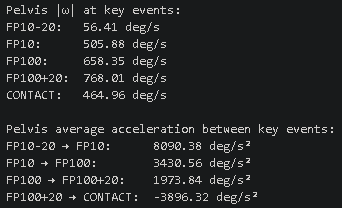</td>
    <td>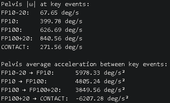</td>
  </tr>
</table>

<table>
  <tr>
    <td align="center"><b>Lefty</b></td>
    <td align="center"><b>Righty</b></td>
  </tr>
  <tr>
    <td>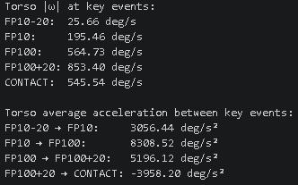</td>
    <td>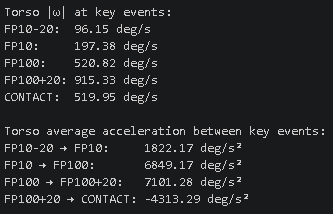</td>
  </tr>
</table>

<table>
  <tr>
    <td align="center"><b>Lefty</b></td>
    <td align="center"><b>Righty</b></td>
  </tr>
  <tr>
    <td>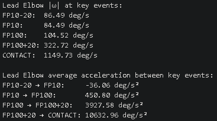</td>
    <td>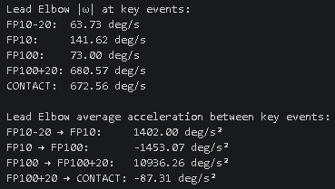</td>
  </tr>
</table>

<table>
  <tr>
    <td align="center"><b>Lefty</b></td>
    <td align="center"><b>Righty</b></td>
  </tr>
  <tr>
    <td>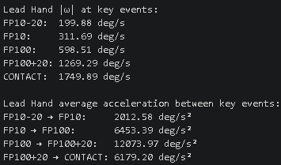</td>
    <td>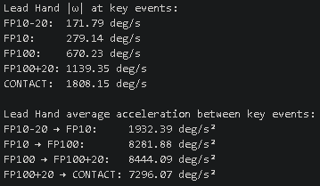</td>
  </tr>
</table>

<table>
  <tr>
    <td align="center"><b>Lefty</b></td>
    <td align="center"><b>Righty</b></td>
  </tr>
  <tr>
    <td>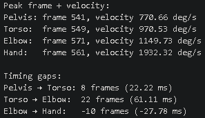</td>
    <td>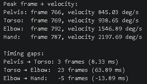</td>
  </tr>
</table>

<table>
  <tr>
    <td align="center"><b>Lefty</b></td>
    <td align="center"><b>Righty</b></td>
  </tr>
  <tr>
    <td>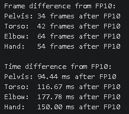</td>
    <td>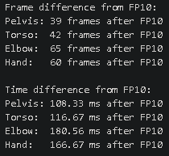</td>
  </tr>
</table>

<table>
<tr>
  <td align="center"><b>Lefty</b></td>
  <td align="center"><b>Righty</b></td>
</tr>
<tr>
  <td></td>
  <td></td>
</tr>
</table>

<table>
<tr>
  <td align="center"><b>Lefty</b></td>
  <td align="center"><b>Righty</b></td>
</tr>
<tr>
  <td></td>
  <td></td>
</tr>
</table>

<table>
<tr>
  <td align="center"><b>Lefty</b></td>
  <td align="center"><b>Righty</b></td>
</tr>
<tr>
  <td>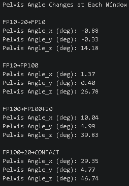</td>
  <td>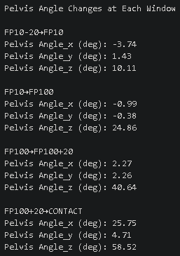</td>
</tr>
</table>

<table>
<tr>
  <td align="center"><b>Lefty</b></td>
  <td align="center"><b>Righty</b></td>
</tr>
<tr>
  <td>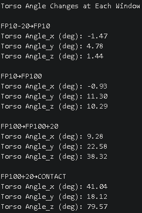</td>
  <td>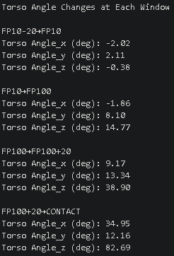</td>
</tr>
</table>

<table>
  <tr>
    <td align="center"><b>Lefty</b></td>
    <td align="center"><b>Righty</b></td>
  </tr>
  <tr>
    <td></td>
    <td></td>
  </tr>
</table>

<table>
  <tr>
    <td align="center"><b>Lefty</b></td>
    <td align="center"><b>Righty</b></td>
  </tr>
  <tr>
    <td></td>
    <td></td>
  </tr>
</table>

<table>
  <tr>
    <td align="center"><b>Lefty</b></td>
    <td align="center"><b>Righty</b></td>
  </tr>
  <tr>
    <td>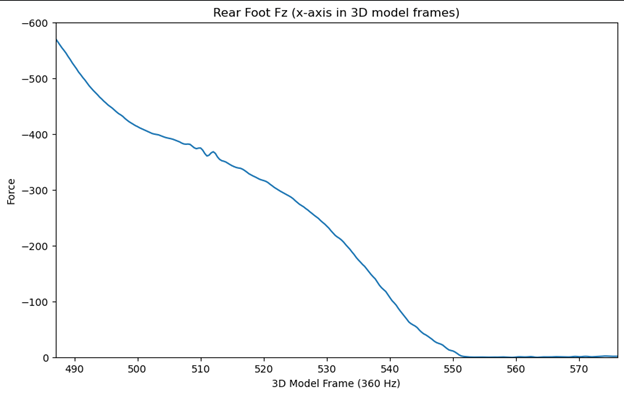</td>
    <td>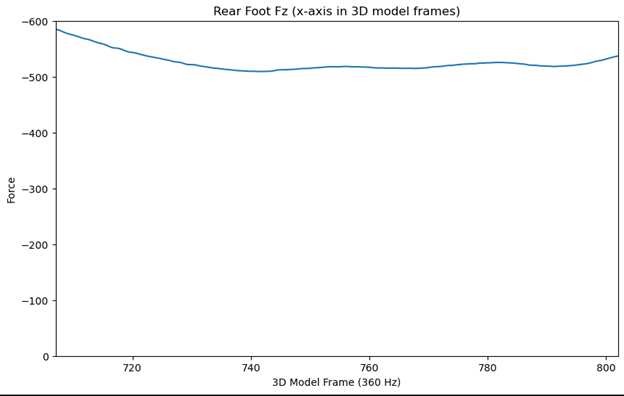</td>
  </tr>
</table>

## Key Takeaways

- **Peak force ≠ acceleration**
  - The righty generates higher peak lead leg force, but overall impulse is similar between swings.
  - This shows that how force is applied over time (not just peak magnitude) is critical for generating rotational acceleration.

- **Force timing drives rotational acceleration**
  - The righty produces a sharper, more time-concentrated force application, leading to higher pelvis acceleration.
  - The lefty applies force over a longer window, resulting in similar impulse but lower peak acceleration.

- **Early-phase differences matter**
  - From FP10-20 → FP10, the lefty actually shows higher early pelvis acceleration and rotation.
  - However, this does not translate into later explosive acceleration into FP100 and beyond.

- **Energy transfer inefficiency in the lefty**
  - Despite similar impulse, the lefty converts force into rotational velocity less efficiently.
  - This suggests potential losses in:
    - segment sequencing  
    - lead leg blocking  
    - or rotational stiffness

- **Sequencing and acceleration windows are key separators**
  - The righty shows a more pronounced acceleration window between FP100 → contact.
  - This aligns with more effective proximal-to-distal energy transfer.

- **Multi-planar contributions remain consistent**
  - Most rotational velocity is driven by the axial (z) plane, with smaller contributions from x and y.
  - Differences between hitters are driven more by magnitude and timing than by directional strategy.

- **Practical implication**
  - Improving the lefty’s performance likely requires:
    - increasing peak force rate (RFD)  
    - improving lead leg block stiffness  
    - tightening timing of force application relative to rotation  
